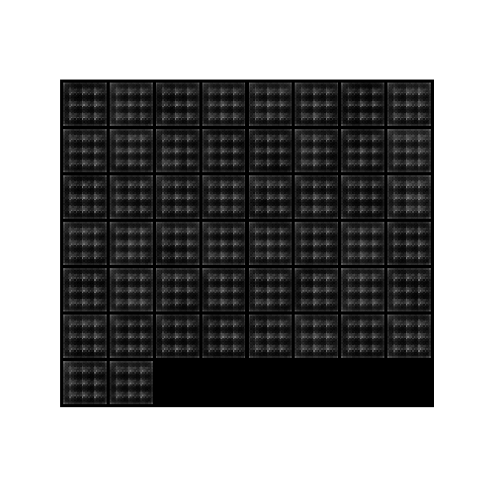
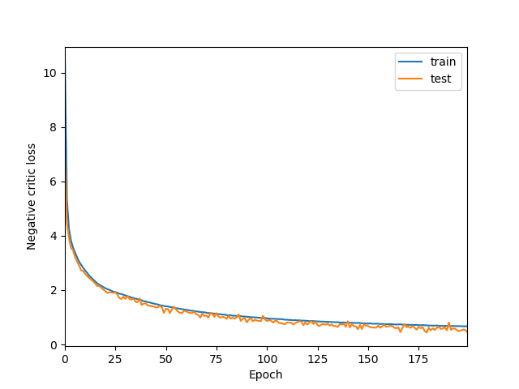

# improved-WGANs
A PyTorch implementation of Wasserstein GAN with gradient penalty (WGAN-GP) 
based on [Improved Training of Wasserstein GANs](https://arxiv.org/abs/1704.00028) that is applied to MNIST data.

## Examples
In the figures below, it can be seen that sample quality increases and the losses converge toward a minimum as training progresses. There is no divergence between the training loss and the test loss, which indicates that the critic is learning a good fit to the data.

 

## Usage
```python3 main.py --datapath /path/to/data```
